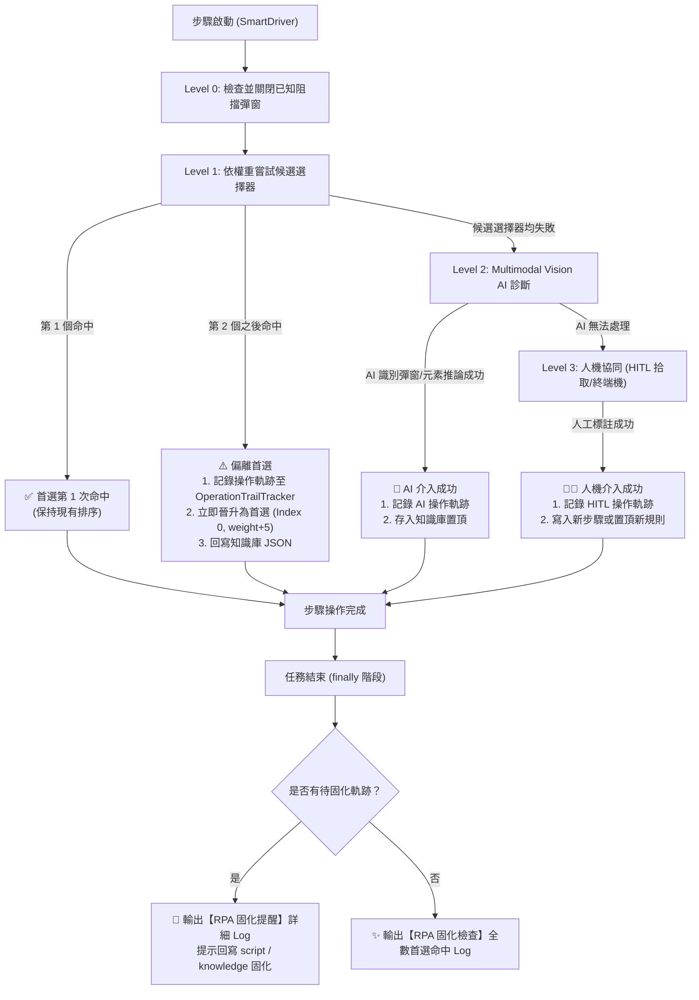

# Video RPA CLI 自動化影音發佈系統

本專案為基於 Selenium、Gemini Vision AI 與知識庫自癒架構的影音多平台自動化發佈系統。支援將影片一鍵批次發佈至 **YouTube**、**Bilibili**、**小紅書 (Rednote)** 與 **TikTok**。

系統內建四層自癒機制（Level 0~3）與 **「操作軌跡追蹤與自動首位晉升固化機制 (Operation Trail & Self-Healing Consolidation)」**，確保當網頁前端改版或元素位置異動時，能自動記錄軌跡、動態回寫知識庫，並於任務結束後提供代碼固化指引，實現「後續執行第 1 次就命中」的高穩定性。

專案遵循現代 Python Best Practice，採用標準 **`src-layout`** (`src/video_rpa/`) 與 PEP 621 標準 `pyproject.toml` 打包配置。

---

## 核心亮點

### 1. 操作軌跡自動追蹤 (Operation Trail Tracking)
- **非首選命中捕捉**：當步驟無法由第 1 個首選選擇器命中，而進入第 2 個（或之後）備選選擇器時，系統自動記錄該偏離軌跡。
- **AI Agent 與人機協同捕捉**：當既有候選選擇器全部失效，觸發 Gemini Vision AI 視覺分析排除彈窗、推論定位，或由人工介入 (HITL) 拾取元素時，完整記錄操作過程與依據。
- **軌跡保存**：自動將待固化事件記錄於記憶體並持久化存入 `src/video_rpa/knowledge/operation_trail.json`。

### 2. 即時首位晉升回寫機制（確保之後第 1 次命中）
- 任何非首選命中或 AI 定位成功的選擇器，系統會**立即將其晉升為第一順位 (Index 0)**，並賦予超越原最大值的最高權重。
- 即時回寫至各平台的知識庫 JSON 檔案（例如 `src/video_rpa/knowledge/rednote_knowledge.json`），確保下一次執行同一步驟時，**首個嘗試即為該選擇器，達成「第 1 次就命中」且無等待延遲**。

### 3. 任務結束後的固化日誌提醒 (Consolidation Log)
- 無論是單一平台上傳、多平台資料夾批次上傳，或是中途使用者手動按下 `Ctrl+C` 中斷，系統均會在 `finally` 階段統一輸出醒目的 **`🚨【RPA 固化提醒 / Script Consolidation Required】`** 報告。
- 日誌清晰列出：
  - 平台名稱與步驟 ID / 名稱
  - 觸發機制（如：備選選擇器命中第 6/6 個、AI 視覺推論定位）
  - 原首選選擇器（已失效）vs 實際生效選擇器（新首選）
  - 建議回寫目標檔案路徑（如 `src/video_rpa/knowledge/rednote_knowledge.json` 或對應的 Service 腳本）
  - 具體固化操作建議
- 若本次任務所有步驟均順利於首選第 1 次命中，則會輸出：
  `✨【RPA 固化檢查】本次任務所有步驟均於首選選擇器第 1 次命中，無需回寫 script 進行固化。`

### 4. 待固化軌跡即時查詢 CLI
- 提供 `--show-trail` 指令，讓開發者與維護人員隨時調閱當前待固化的軌跡紀錄。

---

## 快速上手與使用範例

### 安裝專案 (可選，供本機 CLI 命令列調用)
```powershell
pip install -e .
```
安裝完成後，即可直接在任意目錄使用 `video-rpa` 命令；若未安裝，亦可隨時透過 `python -m video_rpa.cli` 或 `python -m video_rpa` 執行。

### 1. 檢視目前待固化軌跡報告
隨時查看是否有先前執行中偏離首選或由 AI 介入的步驟：
```powershell
python -m video_rpa.cli --show-trail
```

### 2. 多平台批次上傳 (Multi-Platform Batch Upload)
針對資料夾內的所有影片依序執行 YouTube、Bilibili、小紅書與 TikTok 上傳：
```powershell
python -m video_rpa.cli multi `
  --folder "F:/Download/2026-09-18-式輿防衛戰" `
  --desc "練度展示於結尾" `
  --tags "絕區零,zenlesszonezero" `
  --playlist "絕區零-高難"
```

### 3. 單一影片多平台上傳
```powershell
python -m video_rpa.cli multi `
  --file "F:/Download/video.mp4" `
  --desc "測試影片說明" `
  --tags "遊戲,精華" `
  --playlist "精選清單"
```

### 4. 單一平台指定上傳
可單獨針對特定平台執行自動化發佈：
```powershell
# 上傳至 YouTube
python -m video_rpa.cli youtube --file "video.mp4" --playlist "播放清單" --visibility PUBLIC

# 上傳至 Bilibili
python -m video_rpa.cli bilibili --file "video.mp4" --category "游戏" --tags "遊戲標籤"

# 上傳至小紅書 (Rednote)
python -m video_rpa.cli rednote --file "video.mp4" --desc "小紅書筆記內容" --tags "標籤1,標籤2"

# 上傳至 TikTok
python -m video_rpa.cli tiktok --file "video.mp4" --desc "TikTok 影片文案" --tags "TikTokTags"
```

### 常用參數說明
| 參數名稱 | 適用命令 | 說明 |
| :--- | :--- | :--- |
| `--show-trail` | 全域 / 任意子命令 | 顯示當前累積的待固化操作軌跡並結束程式 |
| `--file` | 所有子命令 | 指定單一影片檔案路徑 |
| `--folder` | `multi` | 指定資料夾路徑，批次自然排序處理內部所有影片 |
| `--title` | 所有子命令 | 影片標題（預設為去除副檔名之檔案名稱） |
| `--desc` | 所有子命令 | 影片描述或文案 |
| `--tags` | 所有子命令 | 以逗號分隔之 Hashtags（如 `tag1,tag2`） |
| `--keep-open` | 所有子命令 | 發生錯誤或完成時保持瀏覽器開啟以供除錯 |

---

## 自癒機制與固化維護工作流程



---

## 專案核心目錄架構 (Standard src-layout)

專案內部所有配置、規則與文檔皆遵循跨平台相對路徑規範：

```text
.
├── pyproject.toml                     # PEP 517/518/621 專案打包配置與 Entry Points
├── requirements.txt                   # 依賴清單
├── README.md                          # 專案說明與指南
├── AGENTS.md                          # 專案 Agent 規範與領域特化守則
├── src/
│   └── video_rpa/                     # 核心業務套件
│       ├── __init__.py                # 套件版本與公開 API
│       ├── __main__.py                # 支援 python -m video_rpa
│       ├── cli.py                     # CLI 主命令列入口
│       ├── constants.py               # 全域共用常數 (如 AutoAppendHashtag)
│       ├── core/                      # 自癒引擎、知識庫與視覺分析
│       │   ├── smart_driver.py        # 智慧驅動器
│       │   ├── knowledge_store.py     # 知識庫管理與首位晉升
│       │   ├── trail_tracker.py       # 操作軌跡追蹤與固化報告
│       │   ├── vision_analyzer.py     # Gemini Vision AI 視覺畫面分析
│       │   └── hitl_handler.py        # 人機協同 (HITL) 互動式元素拾取器
│       ├── services/                  # 各平台自動化發佈服務
│       │   ├── youtube_service.py
│       │   ├── bilibili_service.py
│       │   ├── rednote_service.py
│       │   └── tiktok_service.py
│       ├── utils/
│       │   └── webdriver_util.py      # Chrome WebDriver 初始化與排程輔助
│       └── knowledge/                 # 各平台步驟知識庫與持久化軌跡 (Package Data)
│           ├── youtube_knowledge.json
│           ├── bilibili_knowledge.json
│           ├── rednote_knowledge.json
│           ├── tiktok_knowledge.json
│           └── operation_trail.json
├── tests/                             # 單元測試套件
│   ├── conftest.py                    # 測試環境自動設定
│   ├── test_trail_tracker.py          # 軌跡追蹤與首位晉升測試
│   └── test_youtube_self_healing.py   # 自癒驅動測試
└── script/                            # 常用快捷執行腳本 (zzz.ps1, gi.ps1 等)
```
